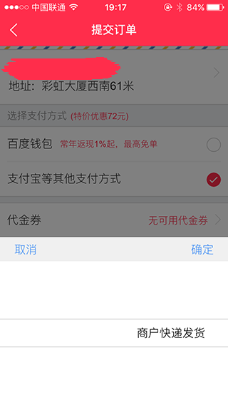

React-SelectView
====

>React-SelectView 是一个模拟ios原生的选择控件。



--------
	
##依赖
    <label>react</label>
    
--------
	
##安装：
    >npm install react-selectview --save
    
--------

##所有配置项 props

    data: array,  数组
    show: bool, 显示或隐藏
    change: function, 点击确认按钮的回调
    selectChange: function, 选择项改变回调
	
--------
## 使用

```

var snedTimeData = [
[], []
];
表示有两个选择项

var snedTimeData = [
[], [], []
];
表示有三个选择项


var snedTimeData = [
[
	{
		name: '2015-02-01',
		value: '2015-02-01'
	},
	{
		name: '2015-02-02',
		value: '2015-02-01'
	}
], [
	{
		name: '06:00',
		value: '1456140397704'
	},
	{
		name: '07:00',
		value: '1456140397306'
	},
	{
		name: '08:00',
		value: '1456140397306'
	}
]
];

<SelectView data={snedTimeData} show={true} change={this.sendTimeChange} selectChange={this.selectChange}>
</SelectView>

```